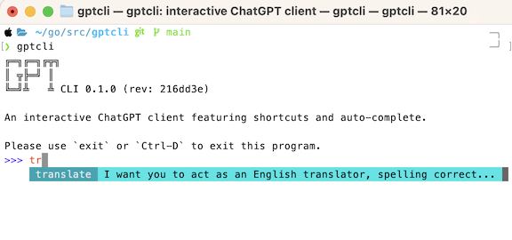

# GPT cli

An interactive ChatGPT client featuring shortcuts and auto-complete.



## What are shortcuts?

Shortcuts are shorthand for specifc prompts. So for example:

- `expand` could be defined as shortcut for: 

    > Expand the following text. Use concise language, an academic tone, avoid unecessary words

- `translate` could be defined as shortcut for:

    > I want you to act as an English translator, spelling corrector and improver. 
    > I will speak to you in any language and you will detect the language, translate it 
    > and answer in the corrected and improved version of my text, in English. My first sentence is

- `pwgen` could be defined as shortcut for:

    > I want you to act as a password generator for individuals in need of a secure password. 
    > Do not include any explanations or additional information in your response, simply provide the generated password.

and so on...

### How can I create my shortcuts?

Create a regular text file in which each line has the format:

```properties 
keyword = prompt 
```

Then define the environment variable `GPTCLI_SHORTCUTS` in such a way that it points to this file.

Here is [an example](.shortcuts) of a file with shortcuts.

```properties 
expand = Expand the following text. Use concise language, an academic tone, avoid unecessary words
translate = I want you to act as an English translator, spelling corrector and improver. I will speak to you in any language and you will detect the language, translate it and answer in the corrected and improved version of my text, in English. My first sentence is
pwgen = I want you to act as a password generator for individuals in need of a secure password. Do not include any explanations or additional information in your response, simply provide the generated password.
```

## How to Run?

[Get an API key from OpenAI](https://platform.openai.com/account/api-keys):

- store it in the environment variable `GPTCLI_API_KEY`
- store your shortcuts file path in the environment variable `GPTCLI_SHORTCUTS`


# How To Install

## MacOs

```sh
brew tap lucasepe/gptcli
brew install gptcli
```

or if you have already installed memo using brew, you can upgrade it by running:

```sh
brew upgrade gptcli
```

## From [binary releases](https://github.com/lucasepe/gptcli/releases) (macOS, Windows, Linux)

Pre-built binaries for the following:

- macOS (Darwin)
- Windows
- Linux

1. Download the appropriate version for your platform from [gptcli releases](https://github.com/lucasepe/gptcli/releases).

2. Once downloaded unpack the archive (zip for Windows; tarball for Linux and macOS) to extract the executable binary. 

3. If you want to use from any location you must put the binary executable to your `Path` or add the directory where is it to the environment variables.

## Using [`Go`](https://go.dev/dl/) toolchain

```sh
go install github.com/lucasepe/gptcli@latest
```
